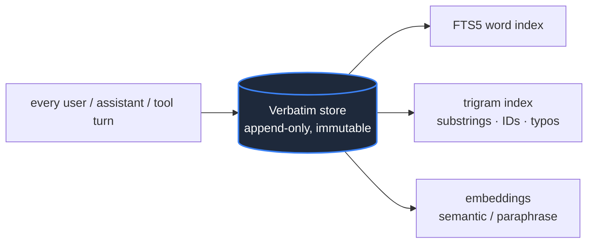
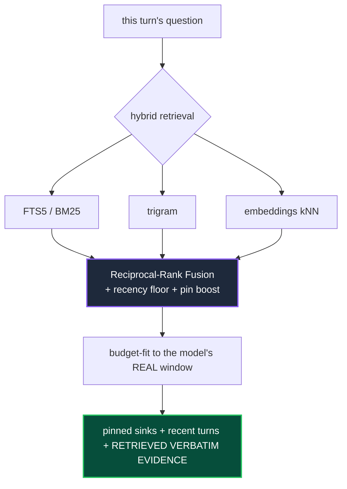
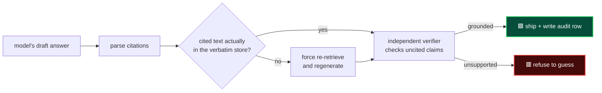

<div align="center">

# hermes-cmx

### Context Memory eXchange

**Your agent stops forgetting. Even on a tiny model.**

A context engine for [Hermes Agent](https://github.com/NousResearch/hermes-agent) that keeps **every message verbatim, forever**, and feeds the model back the exact slices it needs on every single turn. No lossy summaries. No "compress and hope." The model answers from real history, or it honestly says it doesn't know.

[](LICENSE)
[](tests/)
[](#choose-your-backend)
[](https://github.com/NousResearch/hermes-agent)

</div>

---

## The 30-second version

Run an **8,000-token** model. Have a **600-plus-turn** conversation. Ask it about something from turn 12.

It answers correctly, word for word, because the answer never lived in the model's tiny window. It lived in the database, and cmx put the right sentence back in front of the model exactly when it was needed.

That is the whole idea: **memory belongs in a database, not in the model's context window.** Once you accept that, "unlimited context" stops being a marketing claim and becomes a storage problem, and storage is cheap.

```
   Without cmx                              With cmx
   ───────────                              ────────
   turn 600 ─┐                              turn 600 ─┐
   turn 599  │  window full →               turn 599  │  window holds
     ...     │  older turns                   ...      │  recent turns
   turn 581 ─┘  silently dropped            turn 581 ─┘  +
                                            ┌──────────────────────────┐
   "what did we decide                      │ cmx retrieves turn 12    │
    on turn 12?"                            │ verbatim from the DB and │
        │                                   │ injects it, every turn   │
        ▼                                   └──────────────────────────┘
   🟥 makes something up                            │
      (it can't see turn 12)                        ▼
                                            🟩 answers from the real
                                               turn 12, with a citation
```

---

## The problem this kills

Every long agent conversation hits the same wall. The context window fills up, and something has to give.

The usual fix is **summarization**: replace the old turns with a short paraphrase and move on. It feels reasonable. It is also where the trouble starts. The model reads its own lossy summary, treats that paraphrase as the truth, and confidently fills in the gaps it can no longer see. You get an agent that **forgets** the actual decision and then **hallucinates** a plausible-sounding replacement. The longer the session, the worse it gets, and you usually find out at the worst possible moment.

cmx removes the thing that causes this. There is no summary to misread, because nothing is ever summarized. There is no "did the model remember to look it up?", because looking it up is the engine's job, not the model's. And there is no "I think we decided X", because every factual claim the model ships is checked against the verbatim record before it reaches you.

> **The shift in one line:** other engines hope a big window or a clever summary will carry the memory. cmx keeps the memory verbatim and *retrieves* it, then *verifies* the answer against it.

---

## How it works

Three independent paths, each owned by the engine, none relying on the model to behave.

### 1. Ingest: nothing is ever lost



Every message is written verbatim and indexed three ways. The store is **append-only**: compaction never deletes a row, so the full history is always recoverable. This is the single source of truth; every index is a rebuildable accelerator on top of it.

### 2. Assemble: the right slices, every turn



On **every** turn, cmx searches the whole history three different ways, fuses the results, and packs the most relevant verbatim slices into whatever window the model actually has, labelled as evidence the model must cite. A small window just means tighter packing and harder verification. It never silently overflows.

### 3. Enforce: it answers from history, or it doesn't answer



After the model drafts a reply, the engine checks it. Cited claims are verified **deterministically** against the database. Uncited claims get caught by an independent pass. If a claim can't be grounded, cmx forces a re-retrieval and regenerates, and if it still can't be supported, it downgrades to an honest "I don't have that" instead of shipping a guess. Every shipped claim leaves an audit row, so grounding is provable after the fact, not just promised.

---

## Proof, not adjectives

These are real runs you can reproduce from this repo, not aspirations.

**A 1-million-token conversation, ingested in 3 seconds, nothing lost.** A host-faithful stress test drove the real engine to genuine ~1M-token pressure: **1,050,928 tokens across 588 turns**, one compaction, **zero errors**, and both planted sentinel facts (one at the very start, one mid-stream) survived and were retrieved verbatim at the end.

**An 8K-token model answering over a 600+ turn conversation.** With the model's window pinned to **8,000 tokens** (six-plus times too small to hold the conversation), cmx answered single-hop questions over **369 to 663-turn** conversations at **76.5% accuracy**, because the memory was in the database, not the window. The same contract held across `gpt-5-mini`, `gemini-2.5-pro`, and `opus-4.8`.

**Head-to-head against the summarize-and-hope approach** (identical LOCOMO questions, constrained window):

| metric | summarize-and-hope (LCM) | **hermes-cmx** |
|---|---:|---:|
| answerable accuracy | 58.3% | **66.7%** |
| adversarial refusal (caught the trap) | 83.3% | **100%** |
| **hallucination shipped** | 10.0% | **0.0%** |

In production right now, a single cmx store on this setup holds **10,500+ verbatim messages across 120 conversations**, the longest a real **1,300+ turn** working session, all recoverable to the exact word.

> Every number here traces to a file in [`benchmarks/results/`](benchmarks/results/). See [`benchmarks/README.md`](benchmarks/README.md) for the full ledger, including the levers we tried and **rejected** on honest evidence.

---

## Why it stands out

**It keeps everything verbatim.** Other engines compress old turns into summaries and lose the details. cmx never paraphrases anything away. The original words are always there, always retrievable, always citable.

**The engine retrieves, not the model.** Designs that depend on the model choosing to call a "search my history" tool fail the moment the model doesn't bother. In cmx, retrieval happens automatically on every turn. The model can't opt out of remembering.

**Grounding is enforced, not requested.** cmx doesn't ask the model nicely to stay factual. It checks the answer against the database and refuses ungrounded claims. The honesty is structural.

**It's genuinely model-agnostic and window-aware.** A provider-aware tokenizer sizes every allocation to the model's real budget, so the same contract holds whether you're on a 1M-token frontier model or an 8K-token cheap one. Switch models or reasoning effort mid-chat and the store doesn't care: memory lives outside the window.

**It survives the things that break other engines.** Session-id rotation on compaction, the host swapping the message list, per-turn worker threads, providers that truncate history server-side. cmx normalizes session lineage, dedupes by content hash, and serializes its store access, so none of these lose history.

**Better retrieval than word-matching alone.** Hybrid FTS5 + trigram + embeddings, fused with reciprocal-rank fusion, finds substrings, identifiers like `CI4_migrate`, typos, code tokens, and paraphrases that a plain word index misses, and a recency floor guarantees recent turns are always in reach even for vague follow-ups like "ok, continue."

---

## Choose your backend

cmx runs on **SQLite** out of the box, zero configuration, perfect for a single agent on one machine. Point it at **Postgres** (pgvector + pg_trgm) when you want a shared, concurrent, or larger-scale store. Same engine, same contract, same code.

| | SQLite (default) | Postgres (opt-in) |
|---|---|---|
| Setup | none, just enable the plugin | one DSN line |
| Best for | single agent, local, fast start | shared / concurrent / large-scale |
| Storage | `$HERMES_HOME/cmx.db` | your Postgres instance |
| Select it | (default) | `cmx.backend: postgres` + a DSN |

---

## Install

Drop cmx into your Hermes plugins directory and select it as the context engine:

```bash
git clone https://github.com/arminanton/hermes-cmx "$HERMES_HOME/plugins/hermes-cmx"
```

```yaml
# $HERMES_HOME/config.yaml
context:
  engine: cmx
```

Restart Hermes. That's it, you're on the default SQLite backend with verbatim memory and grounding enforcement live.

To run on **Postgres** instead, add a DSN and cmx switches automatically:

```yaml
cmx:
  backend: postgres
  pg_dsn: host=127.0.0.1 port=5432 dbname=cmx user=cmx password=...
```

A ready-to-run Postgres container (pgvector + pg_trgm) is in [`deploy/postgres/`](deploy/postgres/).

> **SQLite note:** cmx uses the FTS5 `trigram` tokenizer (SQLite ≥ 3.34). Hermes ships a `pysqlite3` build that has it, so production is covered. If a stripped-down `sqlite3` lacks trigram, cmx degrades cleanly to FTS5 word matching.

---

## See it in 30 seconds (no model needed)

```bash
git clone https://github.com/arminanton/hermes-cmx
cd hermes-cmx
PYTHONPATH=src python3 examples/01_store_and_retrieve.py
```

```
stored 81 verbatim messages (nothing summarized away)

query: 'which production database and region did we decide on?'
top retrieved verbatim slices:
  [id=41] 'Decision: the production database is Postgres 16 in region eu-west-3.'
  ...
[ok] the exact fact was recovered verbatim from 80 turns of noise ✅
```

Four runnable demos live in [`examples/`](examples/): verbatim recall, surviving session-id rotation, a grounded answer with a citation, and refuse-to-guess in action.

---

## The model's view: four tools, all verbatim

The model can also reach into history directly. Every tool returns **verbatim text with ids**, so anything it uses is immediately citable and checkable. There is deliberately no `summarize` tool that would manufacture a paraphrase.

| Tool | What it does |
|---|---|
| `cmx_grep(query)` | hybrid search across all history (FTS5 + trigram + embeddings) |
| `cmx_recall(n)` | pull a contiguous span of recent verbatim turns |
| `cmx_expand(id)` | rehydrate one exact message by id |

---

## Honest scope

We'd rather you trust this because it's level with you.

**Answerable recall is strong** (evidence-recall@8 climbed from 55% to 82% across our iterations). **Hallucination is minimized, not mathematically eliminated.** On deliberately adversarial, on-topic-but-unanswerable questions (the hardest, rarest kind), larger samples show some residual depending on the model; the early "0%" was small-sample noise and we report the real range openly in [`benchmarks/results/`](benchmarks/results/). refuse-to-guess drives it down hard; it is not a zero guarantee on adversarial bait. For critical work, keep reasoning on and prefer answerable flows. And pool at least five conversations when you measure: per-conversation variance is large, and single runs are noise.

That honesty is the point. cmx is **measured, not asserted**: every claim traces to a result file, and the levers we tried and rejected stay documented as rejected.

---

## The contract (what cmx will never do)

1. **Verbatim is the only truth.** The model reasons from retrieved original text, never a paraphrase.
2. **The engine owns grounding, not the model.** Nothing depends on the model *choosing* to behave.
3. **Every factual claim is checkable.** Cited claims are verified against the store deterministically; uncited ones are caught or refused.
4. **Model-agnostic.** The same contract holds from a frontier model to an 8K-token cheap one; only enforcement strictness changes.
5. **Window-aware.** Everything is sized to the model's real token budget. It never silently overflows.
6. **Lossless and reversible.** Nothing is ever deleted. cmx can import an existing LCM store, and reverting is one config line.
7. **Measured, not asserted.** Claims trace to a result file. Rejected levers stay rejected and documented.

---

## Learn more

- [`docs/00-OVERVIEW.md`](docs/00-OVERVIEW.md): the *why* and the design principles
- [`docs/01-ARCHITECTURE.md`](docs/01-ARCHITECTURE.md): storage, retrieval, and the turn lifecycle
- [`docs/02-GROUNDING-ENFORCEMENT.md`](docs/02-GROUNDING-ENFORCEMENT.md): how the engine forces grounding
- [`benchmarks/README.md`](benchmarks/README.md): every lever, every number, honestly
- [`docs/deliverable/cmx-DELIVERABLE.md`](docs/deliverable/cmx-DELIVERABLE.md): the proven config and install detail

---

<div align="center">

**hermes-cmx** · MIT licensed · built for [Hermes Agent](https://github.com/NousResearch/hermes-agent)

*Bounded window. Unbounded, verbatim memory. The model stops guessing.*

</div>
