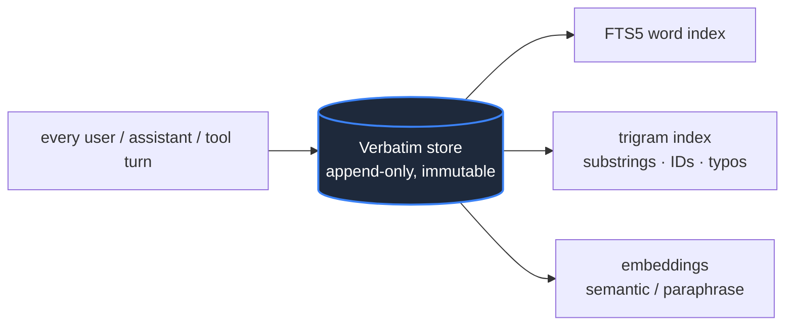
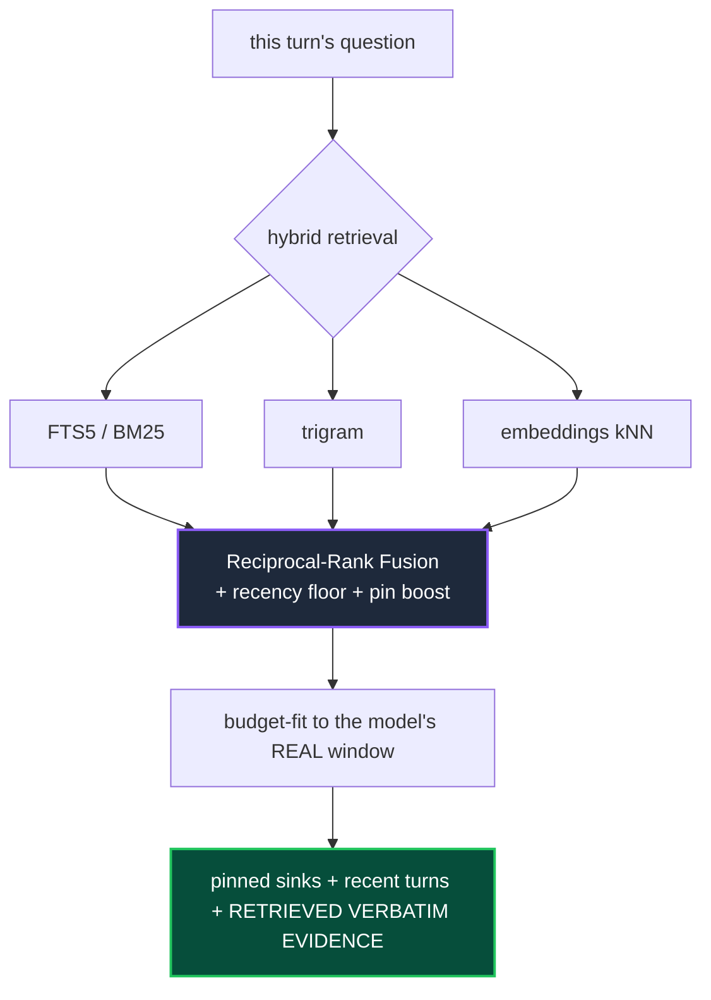
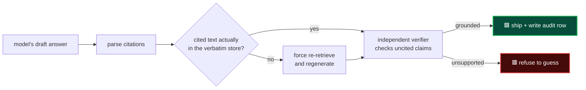

<div align="center">


# hermes-cmx

### 🧠 Context Memory eXchange

#### Your agent stops forgetting. Even on a tiny model.

A context engine for **[Hermes Agent](https://github.com/NousResearch/hermes-agent)** that keeps *every message verbatim, forever*, and feeds the model back the exact slices it needs on every single turn.
No lossy summaries. No "compress and hope." The model answers from real history, or it honestly says it doesn't know.

<br/>

[](LICENSE)
[](tests/)
[](#-choose-your-backend)
[](#-proof-not-adjectives)
[](https://github.com/NousResearch/hermes-agent)

<br/>

**[Why](#-the-problem-this-kills) · [How it works](#-how-it-works) · [Proof](#-proof-not-adjectives) · [Install](#-install) · [Backends](#-choose-your-backend) · [FAQ](#-faq)**

</div>

---

## ⚡ The 30-second version

Run an **8,000-token** model. Have a **600-plus-turn** conversation. Ask it about something from turn 12.

It answers correctly, word for word, because the answer never lived in the model's tiny window. It lived in the database, and cmx put the right sentence back in front of the model exactly when it was needed.

> **The whole idea:** memory belongs in a *database*, not in the model's *context window*. Once you accept that, "unlimited context" stops being a marketing claim and becomes a storage problem. And storage is cheap.

<table>
<tr>
<th width="50%">❌ Without cmx</th>
<th width="50%">✅ With cmx</th>
</tr>
<tr>
<td valign="top">

<pre>
turn 600 ┐
turn 599 │ window full →
  ...    │ older turns
turn 581 ┘ silently dropped

"what did we decide
 on turn 12?"
      │
      ▼
🟥 makes something up
   (it can't see turn 12)
</pre>

</td>
<td valign="top">

<pre>
turn 600 ┐ window holds
turn 599 │ recent turns
  ...    │      +
turn 581 ┘ cmx retrieves
           turn 12 verbatim
           from the DB and
           injects it every turn
      │
      ▼
🟩 answers from the real
   turn 12, with a citation
</pre>

</td>
</tr>
</table>

---

## 🔥 The problem this kills

Every long agent conversation hits the same wall. The context window fills up, and something has to give.

The usual fix is **summarization**: replace the old turns with a short paraphrase and move on. It feels reasonable. It is also where the trouble starts. The model reads its own lossy summary, treats that paraphrase as the truth, and confidently fills in the gaps it can no longer see. You get an agent that **forgets** the actual decision and then **hallucinates** a plausible-sounding replacement. The longer the session, the worse it gets, and you usually find out at the worst possible moment.

cmx removes the thing that causes this:

| The old way | What cmx does instead |
|---|---|
| 📝 Summarize old turns into a paraphrase | 🗄️ Keep every message **verbatim**, forever |
| 🙏 Hope the model looks things up | ⚙️ The **engine** retrieves, every turn, automatically |
| 🎲 Trust the model to stay factual | 🔒 **Verify** every claim against the store, or refuse |

> **In one line:** other engines hope a big window or a clever summary will carry the memory. cmx keeps the memory verbatim and *retrieves* it, then *verifies* the answer against it.

---

## 🧩 How it works

Three independent paths, each owned by the engine, none relying on the model to behave.

### 1️⃣ Ingest — nothing is ever lost



Every message is written verbatim and indexed three ways. The store is **append-only**: compaction never deletes a row, so the full history is always recoverable. This is the single source of truth; every index is a rebuildable accelerator on top of it.

### 2️⃣ Assemble — the right slices, every turn



On **every** turn, cmx searches the whole history three different ways, fuses the results, and packs the most relevant verbatim slices into whatever window the model actually has, labelled as evidence the model must cite. A small window just means tighter packing and harder verification. It never silently overflows.

### 3️⃣ Enforce — it answers from history, or it doesn't answer



After the model drafts a reply, the engine checks it. Cited claims are verified **deterministically** against the database. Uncited claims get caught by an independent pass. If a claim can't be grounded, cmx forces a re-retrieval and regenerates, and if it still can't be supported, it downgrades to an honest "I don't have that" instead of shipping a guess. Every shipped claim leaves an audit row, so grounding is provable after the fact, not just promised.

---

## 📊 Proof, not adjectives

> Every number here traces to a real run in [`benchmarks/results/`](benchmarks/results/). Nothing is aspirational.

<table>
<tr>
<td align="center" width="33%">

### 🚀 1,050,928
**tokens** ingested in **3 seconds**
across 588 turns, 0 errors,
both sentinels survived

</td>
<td align="center" width="33%">

### 🪟 8,000
**token window** answering over
**663-turn** conversations
at **76.5%** accuracy

</td>
<td align="center" width="33%">

### 🎯 0.0%
**shipped hallucination**
vs 10.0% for summarize-and-hope
on identical questions

</td>
</tr>
</table>

#### 🥊 Head-to-head vs the summarize-and-hope approach

*Identical LOCOMO questions, constrained window, same model:*

| metric | summarize-and-hope (LCM) | **hermes-cmx** | |
|---|:---:|:---:|:---:|
| answerable accuracy | 58.3% | **66.7%** | 🟢 +8.4 |
| adversarial refusal *(caught the trap)* | 83.3% | **100%** | 🟢 +16.7 |
| **hallucination shipped** | 10.0% | **0.0%** | 🟢 −10.0 |

<details>
<summary><b>📈 The "small model, huge conversation" diagnostic (click to expand)</b></summary>

<br/>

The thesis: *if accuracy holds with a window far too small for the conversation, then memory lives in the database, not the model window.* Window pinned to **8,000 tokens**; conversations 6×+ larger than the window:

| seed | turns ingested | single-hop accuracy |
|---|:---:|:---:|
| 0 | 419 | 75% (9/12) |
| 1 | 369 | 85% (11/13) |
| 2 | 663 | 67% (6/9) |
| **pooled** | **369–663** | **76.5% (26/34)** |

The window held only a handful of turns. Everything else was retrieved from the store on demand. The same contract held across `gpt-5-mini`, `gemini-2.5-pro`, and `opus-4.8`, cheap or capable, small window or large.

</details>

<details>
<summary><b>🏭 Live production numbers (click to expand)</b></summary>

<br/>

A single cmx store on the author's live setup, right now:

| | |
|---|---:|
| verbatim messages stored | **10,500+** |
| distinct conversations | **120** |
| longest single conversation | **1,370+ turns** |
| recoverable to the exact word | **100%** |

The 1M-token stress test (`588 turns / 1,050,928 tokens / 3s / 1 compaction / 0 errors`) planted one sentinel fact at the very start and one mid-stream; both were retrieved verbatim after the full conversation was ingested.

</details>

---

## ✨ Why it stands out

<table>
<tr>
<td width="50%" valign="top">

#### 🗄️ Keeps everything verbatim
Other engines compress old turns into summaries and lose the details. cmx never paraphrases anything away. The original words are always there, always retrievable, always citable.

</td>
<td width="50%" valign="top">

#### ⚙️ The engine retrieves, not the model
Designs that wait for the model to *choose* to search its history fail the moment it doesn't bother. In cmx, retrieval happens automatically on every turn. The model can't opt out of remembering.

</td>
</tr>
<tr>
<td width="50%" valign="top">

#### 🔒 Grounding is enforced, not requested
cmx doesn't ask the model nicely to stay factual. It checks the answer against the database and refuses ungrounded claims. The honesty is structural, not hoped-for.

</td>
<td width="50%" valign="top">

#### 🎚️ Model-agnostic, window-aware
A provider-aware tokenizer sizes every allocation to the model's real budget. The same contract holds on a 1M-token frontier model or an 8K-token cheap one. Switch models mid-chat; the store doesn't care.

</td>
</tr>
<tr>
<td width="50%" valign="top">

#### 🛡️ Survives what breaks other engines
Session-id rotation on compaction, the host swapping the message list, per-turn worker threads, providers that truncate history server-side. cmx normalizes lineage, dedupes by content hash, and serializes store access. None of these lose history.

</td>
<td width="50%" valign="top">

#### 🔎 Smarter retrieval than word-matching
Hybrid FTS5 + trigram + embeddings, fused with reciprocal-rank fusion, finds substrings, identifiers like `CI4_migrate`, typos, code tokens, and paraphrases a plain word index misses. A recency floor keeps recent turns in reach even for "ok, continue."

</td>
</tr>
</table>

---

## 🗄 Choose your backend

cmx runs on **SQLite** out of the box, zero configuration. Point it at **Postgres** when you want a shared, concurrent, or larger store. Same engine, same contract, same code.

| | 🪶 SQLite *(default)* | 🐘 Postgres *(opt-in)* |
|---|---|---|
| **Setup** | none, just enable the plugin | one DSN line |
| **Best for** | single agent, local, fast start | shared / concurrent / large-scale |
| **Storage** | `$HERMES_HOME/cmx.db` | your Postgres instance |
| **Extensions** | FTS5 + trigram (built in) | pgvector + pg_trgm |
| **Select it** | *(default)* | `cmx.backend: postgres` + a DSN |

---

## 📦 Install

```bash
git clone https://github.com/arminanton/hermes-cmx "$HERMES_HOME/plugins/hermes-cmx"
```

```yaml
# $HERMES_HOME/config.yaml
context:
  engine: cmx
```

Restart Hermes. That's it. You're on the default SQLite backend with verbatim memory and grounding enforcement live.

<details>
<summary><b>🐘 Switch to Postgres (click to expand)</b></summary>

<br/>

Add a DSN and cmx switches automatically, no code change:

```yaml
cmx:
  backend: postgres
  pg_dsn: host=127.0.0.1 port=5432 dbname=cmx user=cmx password=...
```

A ready-to-run Postgres container (pgvector + pg_trgm) is in [`deploy/postgres/`](deploy/postgres/):

```bash
cd deploy/postgres && ./run.sh
```

</details>

<details>
<summary><b>⚙️ Config reference (click to expand)</b></summary>

<br/>

Precedence: `CMX_*` env vars → a `cmx:` block in `$HERMES_HOME/config.yaml` → defaults.

| key | default | what it does |
|---|---|---|
| `backend` | `sqlite` | `sqlite` or `postgres` |
| `pg_dsn` | `""` | Postgres DSN (also `CMX_PG_DSN` env) |
| `database_path` | `$HERMES_HOME/cmx.db` | SQLite file location |
| `use_trigram` | `true` | substring / identifier / typo matching |
| `use_embeddings` | `true` | semantic recall (degrades to lexical if unavailable) |
| `rerank` | `true` | cosine rerank of fused results |
| `refuse_to_guess` | per-profile | downgrade ungrounded answers to a refusal |
| `conversation_recent_floor` | `8` | always inject the last N turns, fused with hits |

</details>

> **💡 SQLite note:** cmx uses the FTS5 `trigram` tokenizer (SQLite ≥ 3.34). Hermes ships a `pysqlite3` build that has it, so production is covered. If a stripped-down `sqlite3` lacks trigram, cmx degrades cleanly to FTS5 word matching.

---

## ▶️ See it in 30 seconds (no model needed)

```bash
git clone https://github.com/arminanton/hermes-cmx
cd hermes-cmx
PYTHONPATH=src python3 examples/01_store_and_retrieve.py
```

```text
stored 81 verbatim messages (nothing summarized away)

query: 'which production database and region did we decide on?'
top retrieved verbatim slices:
  [id=41] 'Decision: the production database is Postgres 16 in region eu-west-3.'
  ...
[ok] the exact fact was recovered verbatim from 80 turns of noise ✅
```

<details>
<summary><b>📂 All four demos (click to expand)</b></summary>

<br/>

| # | demo | needs a model? | shows |
|---|---|:---:|---|
| 1 | `01_store_and_retrieve.py` | ❌ | every message stored verbatim; the exact fact recovered from 80 turns of noise |
| 2 | `02_survives_session_rotation.py` | ❌ | memory survives Hermes session-id rotation via lineage normalization |
| 3 | `03_grounded_answer.py` | ✅ | cmx injects the verbatim slice and a real model answers with a citation |
| 4 | `04_refuse_to_guess.py` | ✅ | an ungrounded guess is replaced with an honest refusal |

Each is self-contained, uses a throwaway temp database, and never touches your live store.

</details>

---

## 🧰 The model's view: four tools, all verbatim

The model can also reach into history directly. Every tool returns **verbatim text with ids**, so anything it uses is immediately citable and checkable. There is deliberately no `summarize` tool that would manufacture a paraphrase.

| tool | what it does |
|---|---|
| 🔍 `cmx_grep(query)` | hybrid search across all history (FTS5 + trigram + embeddings) |
| 📜 `cmx_recall(n)` | return the last N verbatim turns |
| 🔬 `cmx_expand(id)` | rehydrate one exact message by id |

---

## ⚖️ Honest scope

<details open>
<summary><b>Read this before you trust it blindly</b></summary>

<br/>

We'd rather you trust this because it's level with you.

- ✅ **Answerable recall is strong** — evidence-recall@8 climbed from 55% to 82% across our iterations.
- ⚠️ **Hallucination is minimized, not mathematically eliminated.** On deliberately adversarial, on-topic-but-unanswerable questions (the hardest, rarest kind), larger samples show some residual depending on the model. The early "0%" was small-sample noise, and we report the real range openly in [`benchmarks/results/`](benchmarks/results/). refuse-to-guess drives it down hard; it is not a zero guarantee against adversarial bait. For critical work, keep reasoning on and prefer answerable flows.
- 📐 **Pool at least five conversations when you measure.** Per-conversation variance is large, and single runs are noise.

That honesty *is* the point. cmx is **measured, not asserted**: every claim traces to a result file, and the levers we tried and rejected stay documented as rejected.

</details>

---

## 📜 The contract (what cmx will never do)

1. **Verbatim is the only truth.** The model reasons from retrieved original text, never a paraphrase.
2. **The engine owns grounding, not the model.** Nothing depends on the model *choosing* to behave.
3. **Every factual claim is checkable.** Cited claims are verified against the store deterministically; uncited ones are caught or refused.
4. **Model-agnostic.** The same contract holds from a frontier model to an 8K-token cheap one; only enforcement strictness changes.
5. **Window-aware.** Everything is sized to the model's real token budget. It never silently overflows.
6. **Lossless and reversible.** Nothing is ever deleted. cmx can import an existing LCM store, and reverting is one config line.
7. **Measured, not asserted.** Claims trace to a result file. Rejected levers stay rejected and documented.

---

## ❓ FAQ

<details>
<summary><b>Does the model literally see the whole conversation?</b></summary>

<br/>

No, and that's the point. A closed-API model has a finite window, so "the model sees everything" is physically impossible past a certain length. cmx delivers the achievable maximum: **lossless recoverable infinity**. Everything is kept verbatim, and on each turn the *relevant* verbatim is placed in the window, with the answer verified against it.

</details>

<details>
<summary><b>Why not just use a 1M-token model and skip all this?</b></summary>

<br/>

Two reasons. First, even huge windows suffer "lost in the middle" and context rot, so a big window is not the same as grounded recall. Second, big windows are expensive per turn; cmx lets a small, cheap, fast model run an arbitrarily long conversation, because only the verification step needs to be capable.

</details>

<details>
<summary><b>What happens when the model tries to make something up?</b></summary>

<br/>

The enforcement pass catches it. A cited claim whose text isn't actually in the store fails the deterministic check; an uncited claim that isn't supported gets caught by the independent verifier. cmx forces a re-retrieval and regenerates, and if the answer still can't be grounded, it ships an honest refusal instead of a guess.

</details>

<details>
<summary><b>Is it tied to one model or provider?</b></summary>

<br/>

No. The store is independent of the model window. Switch models or reasoning effort mid-conversation and nothing is lost. A provider-aware tokenizer sizes everything to whatever window the current model actually has.

</details>

<details>
<summary><b>Can I migrate off my current LCM setup?</b></summary>

<br/>

Yes, losslessly. cmx can import an existing LCM verbatim store, and switching back is a single config line. Nothing is deleted either way.

</details>

---

## 📚 Learn more

| doc | what's inside |
|---|---|
| [`docs/00-OVERVIEW.md`](docs/00-OVERVIEW.md) | the *why* and the design principles |
| [`docs/01-ARCHITECTURE.md`](docs/01-ARCHITECTURE.md) | storage, retrieval, and the turn lifecycle |
| [`docs/02-GROUNDING-ENFORCEMENT.md`](docs/02-GROUNDING-ENFORCEMENT.md) | how the engine forces grounding |
| [`benchmarks/README.md`](benchmarks/README.md) | every lever, every number, honestly |
| [`docs/deliverable/cmx-DELIVERABLE.md`](docs/deliverable/cmx-DELIVERABLE.md) | the proven config and install detail |

---

<div align="center">

**hermes-cmx** · MIT licensed · built for **[Hermes Agent](https://github.com/NousResearch/hermes-agent)**

*Bounded window. Unbounded, verbatim memory. The model stops guessing.*

<sub>Made for agents that need to remember everything, and admit when they don't.</sub>

</div>
